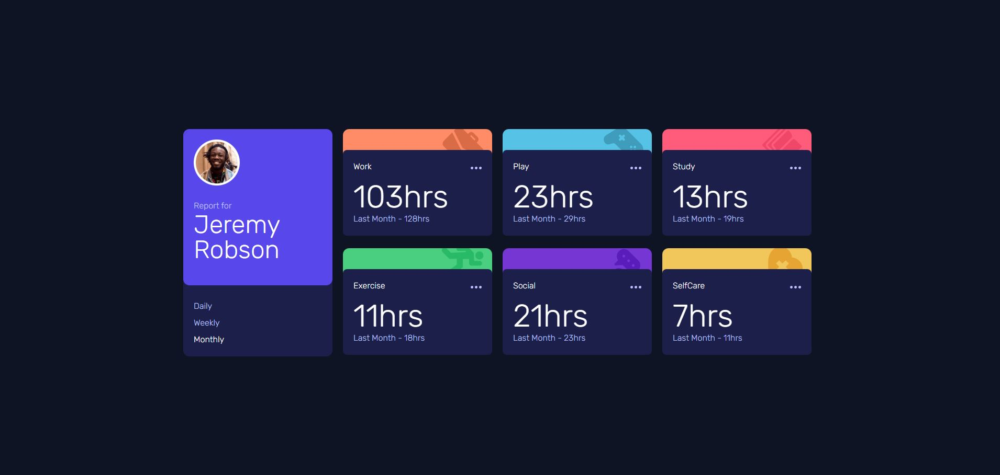
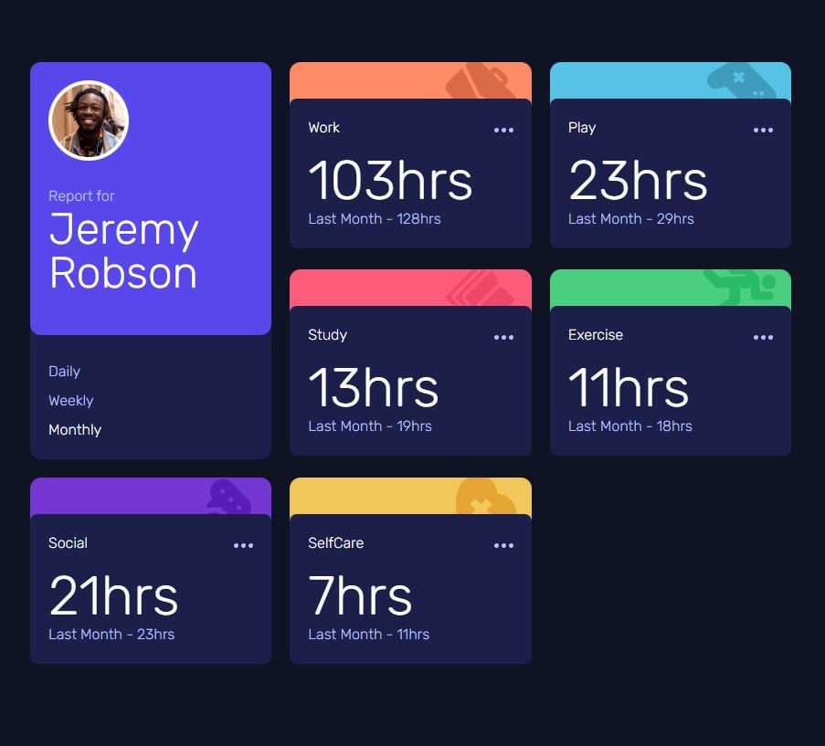
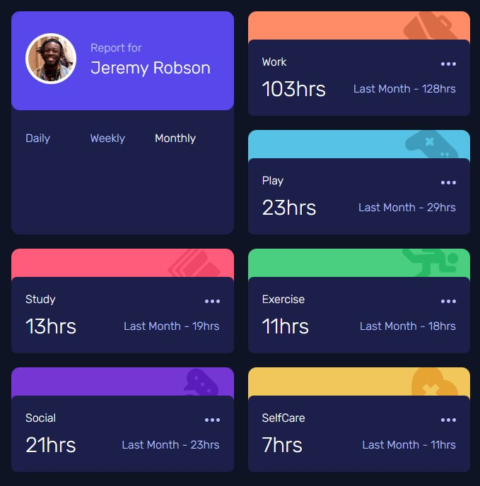
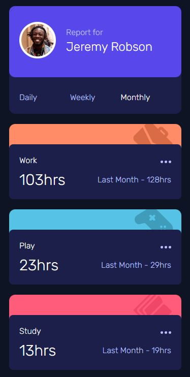

# Time Tracking Dashboard (React + Tailwindcss)

A responsive and interactive time tracking dashboard designed by Frontend Mentor. Built using React and Tailwindcss.

[Try the demo here](https://time-tracking-dashboard-683c2.web.app/)

## How it looks on different devices

### Desktop

### Smaller desktop

### Tablet

### Mobile

